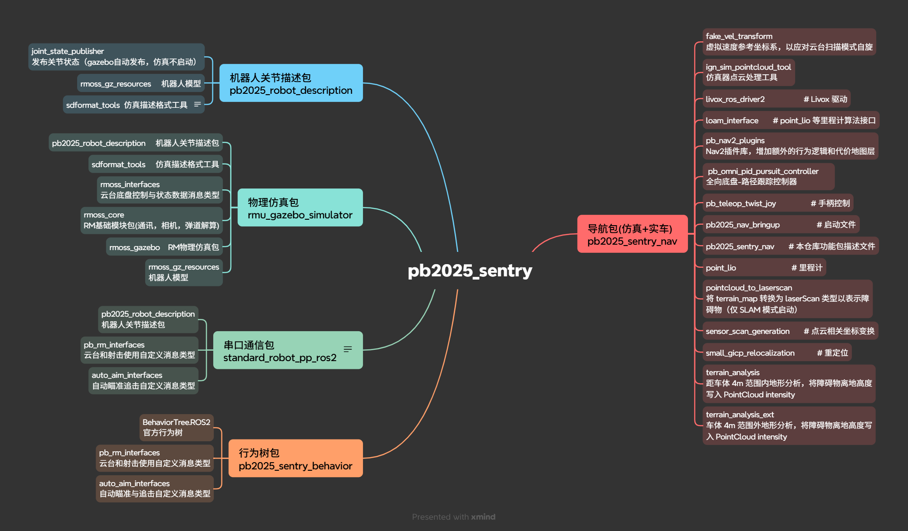
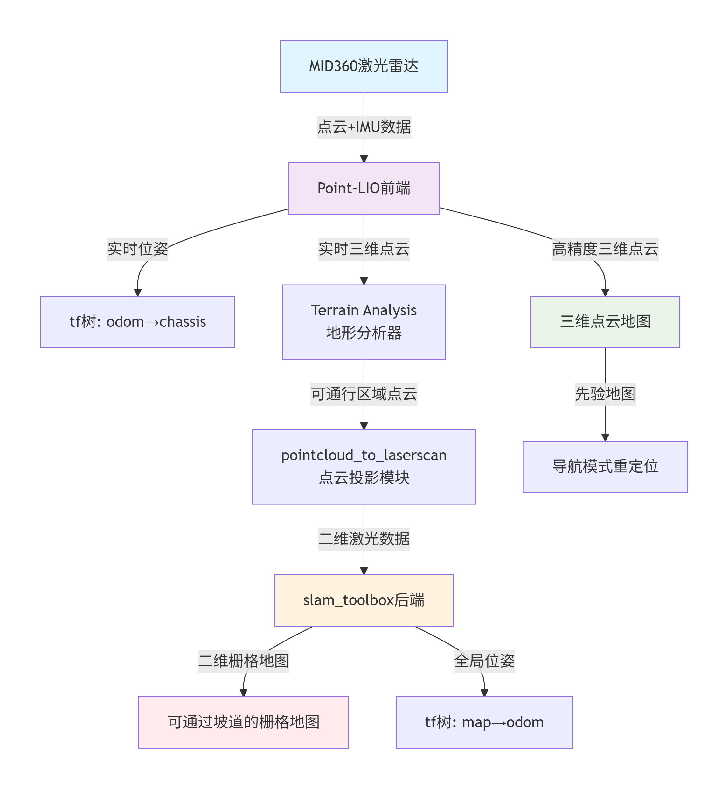
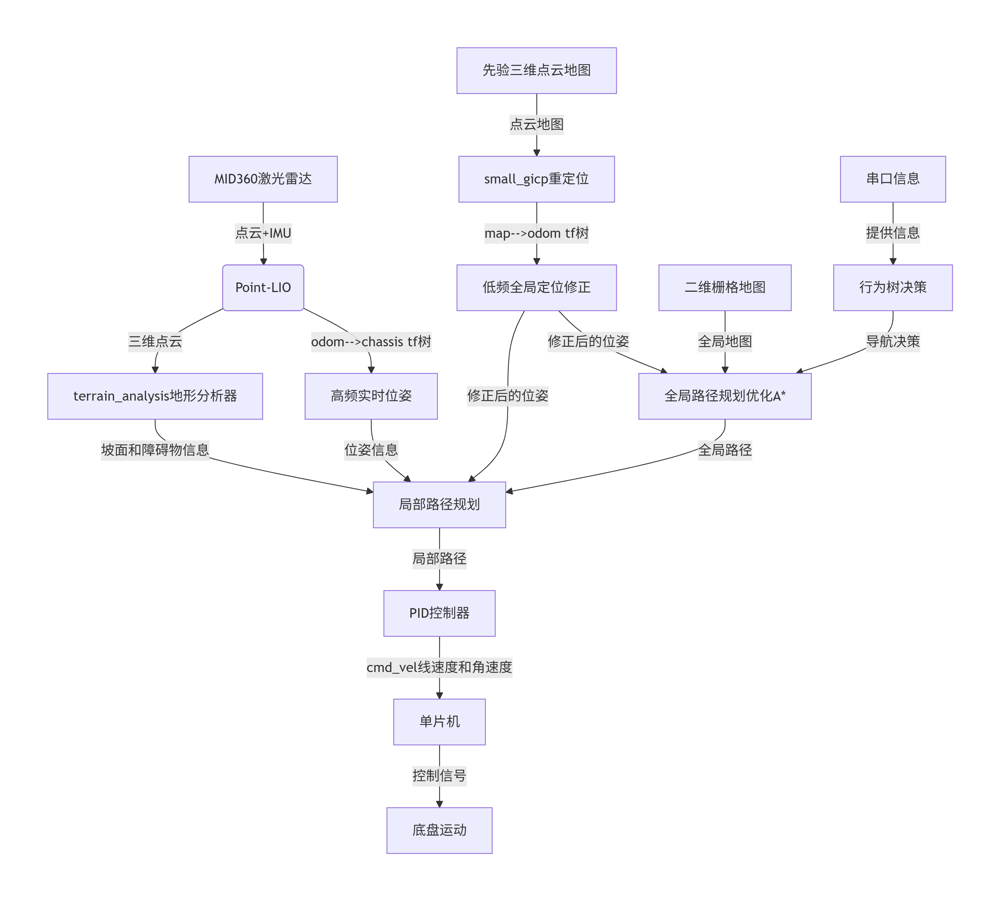

# sentry_nav_fjut

##### 本套哨兵导航代码在pb2025_sentry_nav的基础上进行了修改和优化，以适应FJUT哨兵机器人。
##### 其中包含：导航包（实车+仿真），机器人关节描述包，物理仿真包，串口通信包和行为树包，如图所示

##### 建图数据流向图：

##### 导航数据流向图：

#####
### 相较于pb2025更新内容：
##### 1、pb_rm_interfaces 数据接口GameRobotHP
##### 2、pb2025_robot_description 增加了符合fjut的机器人模型和相应launch文件
##### 3、pb2025_sentry_behavior 增加了行为树相关的xml（src/pb2025_sentry_behavior/behavior_trees）
##### 和行为树相关节点的cpp与hpp文件，和相应launch文件与cmake文件。
##### （src/pb2025_sentry_behavior/plugins/condition）
##### （src/pb2025_sentry_behavior/include/pb2025_sentry_behavior/plugins/condition）
##### 4.更改了livox驱动中的雷达ip(src/pb2025_sentry_nav/livox_ros_driver2/config/MID360_config.json)
##### 5.更改感知建图和导航相关参数，与同文件夹中的launch文件
##### （src/pb2025_sentry_nav/pb2025_nav_bringup/config/reality）
##### 6.串口文件更改
##### src/standard_robot_pp_ros2/include/standard_robot_pp_ros2/packet_typedef.hpp
##### src/standard_robot_pp_ros2/launch/standard_robot_pp_ros2.launch.py
##### src/standard_robot_pp_ros2/src/standard_robot_pp_ros2.cpp
##### 7、添加姿态切换功能：消息接口src/pb_rm_interfaces/msg/PostureCmd.msg,串口通信包中添加姿态切换功能，行为树中添加姿态切换节点
##### 8、加入军临战队2025赛季开发的地图坐标查看文件，用于查看pgm地图中的坐标点，方便写行为树
```bash
./location.sh
```
##### 9、添加功能包referee_sim，用于仿真裁判系统,详情看其下的readme
```bash
./referee_sim.sh
```
##### 10、添加功能包waypoint_editor，用于输出连续导航点，用于多点连线导航；行为树有使用案例
```bash
./waypoint_editor.sh
```
运行脚本后，先加载地图，然后添加航点，之后保存csv文件。

##### 11、行为树设计思路
1、插件navigate_through_poses，多点连线导航功能，设计了一个新的行为树supply_outpost_fort.xml，包含补给区、前哨和堡垒三个地点的导航逻辑。
2、插件is_robot_near_pose，通过tf判断坐标点是否到达，避免了之前行为树中通过发布目标点来判断是否到达的逻辑问题。
3、插件need_supply，通过记忆变量，来控制机器人低状态回家，高状态出家逻辑，避免了只有一种状态用来判断回家和出家的问题。

##### 12、局部路径规划器移植了cod战队的mppi，效果不错，尤其在狭窄环境下，能更好地避障。

### 编译与运行测试
#### 1.工作空间外安装 small_gicp
```bash
sudo apt install -y libeigen3-dev libomp-dev

git clone https://github.com/koide3/small_gicp.git
cd small_gicp
mkdir build && cd build
cmake .. -DCMAKE_BUILD_TYPE=Release && make -j
sudo make install
```
#### 2.创建工作空间并编译(限制编译线程数量，防止编译失败)
```bash
mkdir -p ~/sentry_ws
cd ~/sentry_ws
```
```bash
git clone --recursive https://github.com/loong55/sentry_nav.git
```
```bash
cd ~/sentry_ws
rosdep install -r --from-paths src --ignore-src --rosdistro $ROS_DISTRO -y
colcon build --symlink-install --cmake-args -DCMAKE_BUILD_TYPE=Release --executor parallel --parallel-workers 1
```
#### 3.仿真测试
启动gazebo与导航（出家方案），开启gazebo后需要点击左下角三角形按钮
```bash
./simulation_nav_out.sh
```
启动行为树（出家方案）
```bash
./sbt_out.sh
```
裁判系统模拟器（调整机器人或前哨血量，用于机器人决策）
```bash
./refree_sim.sh
```
关闭行为树节点
```bash
./off_bt.sh
```
关闭所有节点
```bash
./kill_node.sh
```
#### 4.实车测试
校准雷达重力
```bash
./livox_driver.sh
```
```bash
./calibrate_gravity.sh
```
启动串口与导航
```bash
nav_no_map.sh
```
启动行为树
```bash
out_bt.sh
```
当前导航系统为边建图边导航模式，可能会有点云残留，可以改为无图导航模式，将slam:改为false即可。但需要有一张2dpgm地图，可以是空地图，也可以是之前建好的地图（因为关了重定位空地图也没事，机器人会用这张图路径规划）。

#### 5.地图预处理与坐标点提取
建图
```bash
./mappping.sh
```
建完图后，用gimp软件对地图进行编辑，擦除障碍物。

定义航点并导出
```bash
./waypoint_editor.sh
```
先导入地图，再插入航点，最后导出csv文件。
其他详细教程参考下面。

## 1.导航包（实车+仿真）
### 1.1 实车导航
1.1.1 代码位置：sentry_nav_fjut/src/sentry_nav_fjut/sentry_nav
1.1.2 代码功能：实车导航代码，包括地图构建、路径规划、路径跟踪、避障等功能


深圳北理莫斯科大学 北极熊战队 2025 赛季哨兵导航仿真/实车包

[BiliBili: 谁说在家不能调车！？更适合新手宝宝的 RM 导航仿真](https://www.bilibili.com/video/BV12qcXeHETR)


## 1. Overview

本项目基于 [NAV2 导航框架](https://github.com/ros-navigation/navigation2) 并参考学习了 [autonomous_exploration_development_environment](https://github.com/HongbiaoZ/autonomous_exploration_development_environment/tree/humble) 的设计。

- 关于坐标变换：

    本项目大幅优化了坐标变换逻辑，考虑雷达原点 `lidar_odom` 与 底盘原点 `odom` 之间的隐式变换。

    mid360 倾斜侧放在底盘上，使用 [point_lio](https://github.com/SMBU-PolarBear-Robotics-Team/point_lio/tree/RM2025_SMBU_auto_sentry) 里程计，[small_gicp](https://github.com/SMBU-PolarBear-Robotics-Team/small_gicp_relocalization) 重定位，[loam_interface](./loam_interface/) 会将 point_lio 输出的 `/cloud_registered` 从 `lidar_odom` 系转换到 `odom` 系，[sensor_scan_generation](./sensor_scan_generation/) 将 `odom` 系的点云转换到 `front_mid360` 系，并发布变换 `odom -> chassis`。

    

- 关于路径规划：

    使用 NAV2 默认的 Global Planner 作为全局路径规划器，pb_omni_pid_pursuit_controller 作为路径跟踪器。

- namespace：

    为了后续拓展多机器人，本项目引入 namespace 的设计，与 ROS 相关的 node, topic, action 等都加入了 namespace 前缀。如需查看 tf tree，请使用命令 `ros2 run rqt_tf_tree rqt_tf_tree --ros-args -r /tf:=tf -r /tf_static:=tf_static -r  __ns:=/red_standard_robot1`

- LiDAR:

    Livox mid360 倾斜侧放在底盘上。

    注：仿真环境中，实际上 point pattern 为 velodyne 样式的机械式扫描。此外，由于仿真器中输出的 PointCloud 缺少部分 field，导致 point_lio 无法正常估计状态，故仿真器输出的点云经过 [ign_sim_pointcloud_tool](./ign_sim_pointcloud_tool/) 处理添加 `time` field。

- 文件结构

    ```plaintext
    .
    ├── fake_vel_transform                  # 虚拟速度参考坐标系，以应对云台扫描模式自旋，详见子仓库 README
    ├── ign_sim_pointcloud_tool             # 仿真器点云处理工具
    ├── livox_ros_driver2                   # Livox 驱动
    ├── loam_interface                      # point_lio 等里程计算法接口
    ├── pb_teleop_twist_joy                 # 手柄控制
    ├── pb2025_nav_bringup                  # 启动文件
    ├── pb2025_sentry_nav                   # 本仓库功能包描述文件
    ├── pb_omni_pid_pursuit_controller      # 路径跟踪控制器
    ├── point_lio                           # 里程计
    ├── pointcloud_to_laserscan             # 将 terrain_map 转换为 laserScan 类型以表示障碍物（仅 SLAM 模式启动）
    ├── sensor_scan_generation              # 点云相关坐标变换
    ├── small_gicp_relocalization           # 重定位
    ├── terrain_analysis                    # 距车体 4m 范围内地形分析，将障碍物离地高度写入 PointCloud intensity
    └── terrain_analysis_ext                # 车体 4m 范围外地形分析，将障碍物离地高度写入 PointCloud intensity
    ```

## 2. Quick Start

### 2.1 Option 1: Docker

#### 2.1.1 Setup Environment

- [Docker](https://docs.docker.com/engine/install/)

- 允许 Docker Container 访问宿主机 X11 显示

    ```bash
    xhost +local:docker
    ```

#### 2.1.2 Create Container

```bash
docker run -it --rm --name pb2025_sentry_nav \
  --network host \
  -e "DISPLAY=$DISPLAY" \
  -v /tmp/.X11-unix:/tmp/.X11-unix \
  -v /dev:/dev \
  ghcr.io/smbu-polarbear-robotics-team/pb2025_sentry_nav:1.3.1
```

### 2.2 Option 2: Build From Source

#### 2.2.1 Setup Environment

- Ubuntu 22.04
- ROS: [Humble](https://docs.ros.org/en/humble/Installation/Ubuntu-Install-Debs.html)
- 配套仿真包（Option）：[rmu_gazebo_simulator](https://github.com/SMBU-PolarBear-Robotics-Team/rmu_gazebo_simulator)
- Install [small_icp](https://github.com/koide3/small_gicp):

    ```bash
    sudo apt install -y libeigen3-dev libomp-dev

    git clone https://github.com/koide3/small_gicp.git
    cd small_gicp
    mkdir build && cd build
    cmake .. -DCMAKE_BUILD_TYPE=Release && make -j
    sudo make install
    ```

#### 2.2.2 Create Workspace

```bash
mkdir -p ~/ros_ws
cd ~/ros_ws
```

```bash
git clone --recursive https://github.com/SMBU-PolarBear-Robotics-Team/pb2025_sentry_nav.git src/pb2025_sentry_nav
```

下载先验点云:

先验点云用于 point_lio 和 small_gicp，由于点云文件体积较大，故不存储在 git 中，请前往 [FlowUs](https://flowus.cn/lihanchen/share/87f81771-fc0c-4e09-a768-db01f4c136f4?code=4PP1RS) 下载。

> 当前 point_lio with prior_pcd 在大场景的效果并不好，比不带先验点云更容易飘，待 Debug 优化

#### 2.2.3 Build

```bash
rosdep install -r --from-paths src --ignore-src --rosdistro $ROS_DISTRO -y
```

```bash
colcon build --symlink-install --cmake-args -DCMAKE_BUILD_TYPE=Release
```

> [!NOTE]
> 推荐使用 --symlink-install 选项来构建你的工作空间，因为 pb2025_sentry_nav 广泛使用了 launch.py 文件和 YAML 文件。这个构建参数会为那些非编译的源文件使用符号链接，这意味着当你调整参数文件时，不需要反复重建，只需要重新启动即可。

### 2.3 Running

可使用以下命令启动，在 RViz 中使用 `Nav2 Goal` 插件发布目标点。

#### 2.3.1 仿真

单机器人：

导航模式：

```bash
ros2 launch pb2025_nav_bringup rm_navigation_simulation_launch.py \
world:=rmuc_2025 \
slam:=False
```

建图模式：

```bash
ros2 launch pb2025_nav_bringup rm_navigation_simulation_launch.py \
slam:=True
```

保存栅格地图：`ros2 run nav2_map_server map_saver_cli -f <YOUR_MAP_NAME>  --ros-args -r __ns:=/red_standard_robot1`

多机器人 (实验性功能) :

当前指定的初始位姿实际上是无效的。TODO: 加入 `map` -> `odom` 的变换和初始化

```bash
ros2 launch pb2025_nav_bringup rm_multi_navigation_simulation_launch.py \
world:=rmul_2024 \
robots:=" \
red_standard_robot1={x: 0.0, y: 0.0, yaw: 0.0}; \
blue_standard_robot1={x: 5.6, y: 1.4, yaw: 3.14}; \
"
```

#### 2.3.2 实车

建图模式：

```bash
ros2 launch pb2025_nav_bringup rm_navigation_reality_launch.py \
slam:=True \
use_robot_state_pub:=True
```

保存栅格地图：`ros2 run nav2_map_server map_saver_cli -f <YOUR_MAP_NAME>  --ros-args -r __ns:=/red_standard_robot1`

导航模式：

注意修改 `world` 参数为实际地图的名称

```bash
ros2 launch pb2025_nav_bringup rm_navigation_reality_launch.py \
world:=H4 \
slam:=False \
use_robot_state_pub:=True
```

### 2.4 Launch Arguments

启动参数在仿真和实车中大部分是通用的。以下是所有启动参数表格的图例。

| 符号 | 含义                       |
| ---- | -------------------------- |
| 🤖    | 适用于实车           |
| 🖥️    | 适用于仿真                 |

| 可用性 | 参数 | 描述 | 类型  | 默认值 |
|-|-|-|-|-|
| 🤖 🖥️ | `namespace` | 顶级命名空间 | string | "red_standard_robot1" |
| 🤖🖥️ | `use_sim_time` | 如果为 True，则使用仿真（Gazebo）时钟 | bool | 仿真: True; 实车: False |
| 🤖 🖥️ | `slam` | 是否启用建图模式。如果为 True，则禁用 small_gicp 并发送静态 tf（map->odom）。然后自动保存 pcd 文件到 [./point_lio/PCD/](./point_lio/PCD/)| bool | False |
| 🤖 🖥️ | `world` | 在仿真模式，可用选项为 `rmul_2024` 或 `rmuc_2024` 或 `rmul_2025` 或 `rmuc_2025` | string | "rmuc_2025" |
|  |  | 在实车模式，`world` 参数名称与栅格地图和先验点云图的文件名称相同 | string | "" |
| 🤖 🖥️ | `map` | 要加载的地图文件的完整路径。默认路径自动基于 `world` 参数构建 | string | 仿真: [rmuc_2025.yaml](./pb2025_nav_bringup/map/simulation/rmuc_2025.yaml); 实车: 自动填充 |
| 🤖 🖥️ | `prior_pcd_file` | 要加载的先验 pcd 文件的完整路径。默认路径自动基于 `world` 参数构建 | string | 仿真: [rmuc_2025.pcd](./pb2025_nav_bringup//pcd/reality/); 实车: 自动填充 |
| 🤖 🖥️ | `params_file` | 用于所有启动节点的 ROS2 参数文件的完整路径 | string | 仿真: [nav2_params.yaml](./pb2025_nav_bringup/config/simulation/nav2_params.yaml); 实车: [nav2_params.yaml](./pb2025_nav_bringup/config/reality/nav2_params.yaml) |
| 🤖🖥️ | `rviz_config_file` | 要使用的 RViz 配置文件的完整路径 | string | [nav2_default_view.rviz](./pb2025_nav_bringup/rviz/nav2_default_view.rviz) |
| 🤖 🖥️ | `autostart` | 自动启动 nav2 栈 | bool | True |
| 🤖 🖥️ | `use_composition` | 是否使用 Composable Node 形式启动 | bool | True |
| 🤖 🖥️ | `use_respawn` | 如果节点崩溃，是否重新启动。本参数仅 `use_composition:=False` 时有效 | bool | False |
| 🤖🖥️ | `use_rviz` | 是否启动 RViz | bool | True |
| 🤖 | `use_robot_state_pub` | 是 是否使用 `robot_state_publisher` 发布机器人的 TF 信息 <br> 1. 在仿真中，由于支持的 Gazebo 仿真器已经发布了机器人的 TF 信息，因此不需要再次发布。 <br> 2. 在实车中，**推荐**使用独立的包发布机器人的 TF 信息。例如，`gimbal_yaw` 和 `gimbal_pitch` 关节位姿由串口模块 [standard_robot_pp_ros2](https://github.com/SMBU-PolarBear-Robotics-Team/standard_robot_pp_ros2) 提供，此时应将 `use_robot_state_pub` 设置为 False。 <br> 如果没有完整的机器人系统或仅测试导航模块（此仓库）时，可将 `use_robot_state_pub` 设置为 True。此时，导航模块将发布静态的机器人关节位姿数据以维护 TF 树。 <br> *注意：需额外克隆并编译 [pb2025_robot_description](https://github.com/SMBU-PolarBear-Robotics-Team/pb2025_robot_description.git)* | bool | False |

> [!TIP]
> 关于本项目更多细节与实车部署指南，请前往 [Wiki](https://github.com/SMBU-PolarBear-Robotics-Team/pb2025_sentry_nav/wiki)

### 2.5 手柄控制

默认情况下，PS4 手柄控制已开启。键位映射关系详见 [nav2_params.yaml](./pb2025_nav_bringup/config/simulation/nav2_params.yaml) 中的 `teleop_twist_joy_node` 部分。


## 3. 实车部署和调参
导航模块参数均放在 [nav2\_param.yaml](https://github.com/SMBU-PolarBear-Robotics-Team/pb2025_sentry_nav/tree/main/pb2025_nav_bringup/config) 文件中，少量参数在 launch 文件中以 parameter 的形式直接读入节点（覆盖 yaml 文件中的参数），一般不需要修改 launch 文件中的参数。

以下分模块说明 `nav2_param.yaml` 中的参数：

## 1\. livox\_ros\_driver2

1.  设置 LiDAR IP
    
    修改 [mid360\_user\_config.json](https://github.com/SMBU-PolarBear-Robotics-Team/pb2025_sentry_nav/blob/82a76439cd6fe46a69a70f1d44afb0875982a82d/pb2025_nav_bringup/config/reality/mid360_user_config.json#L28) 中 `lidar_configs - ip` 参数。
    
    注：若倒置/倾斜安装 LiDAR，**不需要** 修改 `mid360_user_config.json` 文件中的 `roll`, `pitch`, `yaw` 参数，而是在 `pb2025_sentry_robot.sdf.xmacro` 文件中调整 LiDAR 的固连位置，详见实车部署指南。
    
2.  设置 LiDAR 频率
    
    [nav2\_param.yaml](https://github.com/SMBU-PolarBear-Robotics-Team/pb2025_sentry_nav/blob/82a76439cd6fe46a69a70f1d44afb0875982a82d/pb2025_nav_bringup/config/reality/nav2_params.yaml#L6) 文件中，修改 `livox_ros_driver2.publish_freq` 参数。
    

## 2\. point\_lio

1.  固有参数
    
    -   `cut_frame_time_interval`: 1 / LiDAR 频率
        
        实车 LiDAR 频率请查看上一章节 [livox\_ros\_driver2](https://github.com/SMBU-PolarBear-Robotics-Team/pb2025_sentry_nav/wiki/%E5%AE%9E%E8%BD%A6%E8%B0%83%E5%8F%82%E6%8C%87%E5%8D%97#1-livox_ros_driver2) 中提到的 `publish_freq` 参数。
        
    -   `gravity`, `gravity_init`
        
        命令启动 `ros2 launch livox_ros_driver2 msg_MID360_launch.py`，新开一个终端使用 `ros2 topic echo livox/imu` 查看实时 IMU 数据，根据 IMU 线加速度值写入 `gravity` 和 `gravity_init`，注意重力方向加负号。
        
        > 注：[Livox mid360 通信协议](https://livox-wiki-cn.readthedocs.io/zh-cn/latest/tutorials/new_product/mid360/livox_eth_protocol_mid360.html#id7) 中，IMU 加速度单位为 g。  
        > TODO: 挖坑，后续可能会给 point\_lio 加入初始重力方向自动校准的功能。欢迎 PR。
    
2.  LIO 调参指南（整理自各个 Issue）
    
    室内可以把 `filter_size_surf`, `filter_size_map` 调小一点，一般分别为 0.05, 0.15. 对于 ouster 或者这种点特别多的，`point_filter_num` 可以调大，比如 5~10.
    
    当点云较密集时，用较大的 `lidar_meas_cov`。结构较单一时，用较大的 `lidar_meas_cov` 。
    
    其他参数待补充...

实车部署与仿真主要区别在于：使用上下位机串口通信模块替代仿真器的数据接口（如点云、速度控制、`TF`、`joint_states` 等）。以下将详细介绍如何进行相关配置。

## 1\. 机器人描述文件

在实车部署中，需修改 [pb2025\_robot\_description](https://github.com/SMBU-PolarBear-Robotics-Team/pb2025_robot_description) 功能包中的 [pb2025\_sentry\_robot.sdf.xmacro](https://github.com/SMBU-PolarBear-Robotics-Team/pb2025_robot_description/blob/main/resource/xmacro/pb2025_sentry_robot.sdf.xmacro)。建议基于现有文件创建一份属于自己队伍的机器人描述文件（例如 `smbu_sentry_robot.sdf.xmacro`）。创建完成后，需要将 [robot\_name](https://github.com/SMBU-PolarBear-Robotics-Team/pb2025_robot_description/blob/2543d91e1b5bc70fd2d6cfb259f651642d8c1f73/launch/robot_description_launch.py#L116-L120) 更改为新文件无后缀的文件名（如 `smbu_sentry_robot`）。

### 1.1 修改传感器位置

在机器人描述文件中，需重点关注传感器的固连位置，例如 [livox mid360](https://github.com/SMBU-PolarBear-Robotics-Team/pb2025_robot_description/blob/2543d91e1b5bc70fd2d6cfb259f651642d8c1f73/resource/xmacro/pb2025_sentry_robot.sdf.xmacro#L20) 的配置中 `parent` 和 `pose` 参数，请根据你的实车进行调整。

1.  `parent`
    
    指定传感器固连的坐标系，例如：
    
    -   `chassis`
    -   `gimbal_yaw`
    -   `gimbal_pitch`
2.  `pose`
    
    `pose` 由六个数字组成，依次为 `x`, `y`, `z`, `roll`, `pitch`, `yaw`，通过空格分隔，表示传感器相对于 `parent` 坐标系的变换。单位与方向需遵循 [REP-0103](https://www.ros.org/reps/rep-0103.html) 标准。
    

### 1.2 可视化机器人模型

-   修改机器人描述文件后，可以通过以下命令在 RViz 中可视化机器人模型：
    
    ```shell
    ros2 launch pb2025_robot_description robot_description_launch.py
    ```
    
-   可通过以下命令查看 TF 树
    
    注：如果无需 namespace，请删除第二句命令末尾的 `-r __ns:=/red_standard_robot1`
    
    ```shell
    sudo apt install ros-humble-rqt-tf-tree
    ```
    
    ```shell
    ros2 run rqt_tf_tree rqt_tf_tree --ros-args -r /tf:=tf -r /tf_static:=tf_static -r __ns:=/red_standard_robot1
    ```
    

## 2\. 上下位机串口通信模块

串口通信模块是实车部署时上下位机通信的桥梁，可以参考 [standard\_robot\_pp\_ros2](https://github.com/SMBU-PolarBear-Robotics-Team/standard_robot_pp_ros2.git) 的实现方式。

在导航模块中，串口通信模块的主要功能包括：

1.  订阅 `cmd_vel` 话题
    
    接收 [Twist](https://docs.ros.org/en/humble/p/geometry_msgs/interfaces/msg/Twist.html) 数据类型的速度控制指令，并通过串口将其传输至 RoboMaster C 型开发板，实现车辆运动控制。
    
2.  发布云台位姿数据
    
    通过串口接收来自 RoboMaster C 型开发板的数据，发布数据类型为 [sensor\_msgs/msg/JointState](https://docs.ros.org/en/ros2_packages/humble/api/sensor_msgs/interfaces/msg/JointState.html) 的 `gimbal_yaw` 和 `gimbal_pitch` 位姿数据至 `serial/gimbal_joint_state` 话题。
    
3.  自动建立整车 TF 树
    
    启动 [standard\_robot\_pp\_ros2.launch.py](https://github.com/SMBU-PolarBear-Robotics-Team/standard_robot_pp_ros2/blob/main/launch/standard_robot_pp_ros2.launch.py) 后，通过 [joint\_state\_publisher](https://github.com/ros/joint_state_publisher.git) 和 [robot\_state\_publisher](https://github.com/ros/robot_state_publisher.git)，可以自动生成完整的机器人 TF 树，其中包括：
    
    -   静态 TF (static transforms)：表示传感器和部件的固定坐标关系。
    -   动态 TF (dynamic transforms)：订阅 `serial/gimbal_joint_state` 维护云台的实时 TF。

## 3\. NameSpace

### 3.1 Option 1: 取消导航模块 NameSpace

虽然更推荐保留 NameSpace 的功能，但如果依然想取消导航模块的 NameSpace 也非常简单，只需要将 [rm\_sentry\_reality\_launch.py - declare\_namespace\_cmd](https://github.com/SMBU-PolarBear-Robotics-Team/pb2025_sentry_nav/blob/23eefa312729ab9320efd76e2573ff4bd8b051c8/pb2025_nav_bringup/launch/rm_sentry_reality_launch.py#L49-L54) 中的 `default_value` 改为空字符串即可。

### 3.2 Option 2: 上位机大一统 NameSpace

如果你希望上位机的所有算法模块都带上 NameSpace，请参考本章节，修改已有的其他算法模块。

1.  修改 .cpp, .py 文件中的 `create_publisher()` 和 `create_subscription()` 函数，将 `topic_name` 参数去除字符串开头的 `/`，例如：
    
    ```c
    pcd_pub_ = this->create_publisher<sensor_msgs::msg::PointCloud2>("registered_scan", 5);
    ```
    
2.  修改 launch 文件中 Node 的启动方式
    
    -   方式 1：使用 [PushRosNamespace()](https://docs.ros.org/en/humble/Tutorials/Intermediate/Launch/Using-ROS2-Launch-For-Large-Projects.html#namespaces) 添加到顶层启动文件的 GroupAction 中
        
        ```python
        bringup_cmd_group = GroupAction(
            [
                PushRosNamespace(namespace="red_standard_robot1"),  # Added
                Node(
                    ...
                ),
                IncludeLaunchDescription(
                    ...
                ),
            ]
        )
        ```
        
    -   方式 2：为 **每个** Node 添加 `namespace` 参数
        
        ```python
        start_livox_ros_driver2_node = Node(
            ...
            namespace="red_standard_robot1",                            # Added
        )
        ```
    
3.  为 launch 文件中使用到 `tf2_ros::TransformListener` 和 `tf2_ros::TransformBroadcaster` 的 Node 添加 `remap` 参数。
    
    使得涉及订阅和发布 TF 的 Node 订阅到带命名空间的 TF 话题。
    
    -   方式 1：使用 [SetRemap()](https://github.com/ros2/launch_ros/pull/158) 添加到总启动文件的 GroupAction 中
        
        ```python
        bringup_cmd_group = GroupAction(
            [
                PushRosNamespace(namespace="red_standard_robot1"),
                SetRemap("/tf", "tf"),                                  # Added
                SetRemap("/tf_static", "tf_static"),                    # Added
                Node(
                    ...
                ),
                IncludeLaunchDescription(
                    ...
                ),
            ]
        )
        ```
        
    -   方式 2：为 **每个** Node 添加 `remapping` 参数
        
        ```python
        start_livox_ros_driver2_node = Node(
            ...
            remappings=[("/tf", "tf"), ("/tf_static", "tf_static")]     # Added
        )
        ```
    
4.  为每个 .yaml 参数文件添加 `root_key`，往后的所有节点都使用这个被重写的 `configured_params`。
    
    ```python
    from nav2_common.launch import ReplaceString, RewrittenYaml
    
    configured_params = ParameterFile(
        RewrittenYaml(
            source_file=origin_params_file,     # Load original file
            root_key=namespace,                 # Set namespace
            param_rewrites={},
            convert_types=True,
        ),
        allow_substs=True,
    )
    ```
    
    它的作用相当于在 .yaml 文件顶层加入 `namespace` 字符串，例如：
    
    ```yaml
    sensor_scan_generation:
        ros__parameters:
            lidar_frame: "front_mid360"
            robot_base_frame: "gimbal_yaw"
    ```
    
    会被重写为：
    
    ```yaml
    red_standard_robot1:
        sensor_scan_generation:
            ros__parameters:
                lidar_frame: "front_mid360"
                robot_base_frame: "gimbal_yaw"
    ```

本项目在 [commit 6a09ca3](https://github.com/SMBU-PolarBear-Robotics-Team/pb2025_sentry_nav/commit/6a09ca364b64c29cf4ed0c81cbc2b063370cf762) 前仅支持 pcd2pgm 的方式建图，往后的版本已支持 SLAM 边建图边导航的功能。

当你修改了雷达传感器位置后，先前的栅格地图和先验点云将会失效，需要重新建图。本文档将指导您如何在仿真/实车上重新建图。

## 0\. 准备工作

在开始建图前，请确保已完成以下准备工作：

1.  无论仿真或实车，只要 LiDAR 与车体的相对位置发生变化，请同步修改机器人描述文件和 point\_lio 的 `gravity` 参数，详见 [实车部署指南#11-修改传感器位置](https://github.com/SMBU-PolarBear-Robotics-Team/pb2025_sentry_nav/wiki/%E5%AE%9E%E8%BD%A6%E9%83%A8%E7%BD%B2%E6%8C%87%E5%8D%97#11-%E4%BF%AE%E6%94%B9%E4%BC%A0%E6%84%9F%E5%99%A8%E4%BD%8D%E7%BD%AE) 和 [实车调参指南#2-point\_lio](https://github.com/SMBU-PolarBear-Robotics-Team/pb2025_sentry_nav/wiki/%E5%AE%9E%E8%BD%A6%E8%B0%83%E5%8F%82%E6%8C%87%E5%8D%97#2-point_lio)
    
2.  若为实车部署，请修改 livox\_ros\_driver2 参数中的 ip 地址，详见 [实车调参指南#1-livox\_ros\_driver2](https://github.com/SMBU-PolarBear-Robotics-Team/pb2025_sentry_nav/wiki/%E5%AE%9E%E8%BD%A6%E8%B0%83%E5%8F%82%E6%8C%87%E5%8D%97#1-livox_ros_driver2)
    

## 1\. 启动建图模式

运行以下命令启动建图模式：

```shell
ros2 launch pb2025_nav_bringup rm_sentry_reality_launch.py \
slam:=True \
use_robot_state_pub:=True
```

## 2\. 保存初版地图

### 2.1 方式一：SLAM 边建图边导航

使机器人走完需要建图的区域后，**先不要 Ctrl+C 终止建图程序**，而是新开一个终端，运行以下命令保存地图：

Note

`<YOUR_WORLD_NAME>` 请自行设定并替换为字符串。

Tip

如果不使用 namespace，删除命令末尾的 `--ros-args -r __ns:=/red_standard_robot1` 参数即可。

```shell
ros2 run nav2_map_server map_saver_cli -f <YOUR_MAP_NAME> --ros-args -r __ns:=/red_standard_robot1
```

输入保存地图命令后，会在当前工作空间下生成两个文件：`<YOUR_MAP_NAME>.pgm` 和 `<YOUR_MAP_NAME>.yaml`。

然后 **Ctrl+C 终止建图程序**，将会自动保存 .pcd 文件到本地工作空间下 `point_lio/PCD` 文件夹中，默认名称为 `scan.pcd`。

### 2.2 方式二：pcd2pgm 建图

#### 2.2.1 保存 pcd 文件

使机器人走完需要建图的区域后，**Ctrl+C 终止建图程序**，将会自动保存 .pcd 文件到本地工作空间下 `point_lio/PCD` 文件夹中，默认名称为 `scan.pcd`。

可使用命令：`pcl_viewer -fc 255,255,255 -ax 3 scan.pcd` 预览点云图。

#### 2.2.2 pcd2pgm

功能包的使用说明详见 [pcd2pgm](https://github.com/LihanChen2004/pcd2pgm) README。

主要需要注意 `odom_to_lidar_odom` 参数，应填入机器人速度参考系（即 [nav2\_param](https://github.com/SMBU-PolarBear-Robotics-Team/pb2025_sentry_nav/blob/main/pb2025_nav_bringup/config/reality/nav2_params.yaml) 中的 `robot_base_frame`）到 LiDAR 的变换关系。

输入保存地图命令后，会在当前工作空间下生成两个文件：`<YOUR_MAP_NAME>.pgm` 和 `<YOUR_MAP_NAME>.yaml`。

## 3\. GIMP 精修栅格地图（可选）

1.  安装 GIMP，详细步骤请参考 [GIMP 官网](https://www.gimp.org/)。
    
2.  使用 GIMP 中的橡皮擦工具擦除不需要的区域。您还可以使用画笔工具为地图添加围挡等元素。完成后，将地图保存为 .pgm 格式。
    

可以参考 [navigation2\_with\_keepout\_filter](https://docs.nav2.org/tutorials/docs/navigation2_with_keepout_filter.html) 了解更多修整栅格地图的方法。

## 4\. 重命名并移动至指定文件夹

Note

`<YOUR_WORLD_NAME>` 请自行设定并替换为字符串。

1.  将生成的 `.pcd` 文件重命名为 `<YOUR_WORLD_NAME>.pcd`，然后放置到 [pb2025\_nav\_bringup/pcd](https://github.com/SMBU-PolarBear-Robotics-Team/pb2025_sentry_nav/tree/main/pb2025_nav_bringup/pcd) 的 reality 或 simulation 文件夹内。
    
2.  将生成的 `.pgm` 文件重命名为 `<YOUR_WORLD_NAME>.pgm`；`.yaml` 文件重命名为 `<YOUR_WORLD_NAME>.yaml`，注意同步修改 `.yaml` 文件中的 `image` 字段，将其更新为 `<YOUR_WORLD_NAME>.pgm`。然后将这两个文件移动到 [pb2025\_nav\_bringup/map](https://github.com/SMBU-PolarBear-Robotics-Team/pb2025_sentry_nav/tree/main/pb2025_nav_bringup/map) 中的 reality 或 simulation 文件夹内。
    

## 5\. 编译与运行

完成以上步骤后，重新编译项目以将 map 和 pcd 文件创建符号链接在 install 目录：

```shell
colcon build --symlink-install --cmake-args -DCMAKE_BUILD_TYPE=Release
```

启动已知先验地图的导航模式：

Note

`<YOUR_WORLD_NAME>` 应与 [Step 4](https://github.com/SMBU-PolarBear-Robotics-Team/pb2025_sentry_nav/wiki/%E5%AE%9E%E8%BD%A6%E8%B0%83%E5%8F%82%E6%8C%87%E5%8D%97#4-%E9%87%8D%E5%91%BD%E5%90%8D%E5%B9%B6%E7%A7%BB%E5%8A%A8%E8%87%B3%E6%8C%87%E5%AE%9A%E6%96%87%E4%BB%B6%E5%A4%B9) 中的 `<YOUR_WORLD_NAME>` 保持一致。

```shell
ros2 launch pb2025_nav_bringup rm_sentry_reality_launch.py \
world:=<YOUR_WORLD_NAME> \
slam:=False \
use_robot_state_pub:=True
```