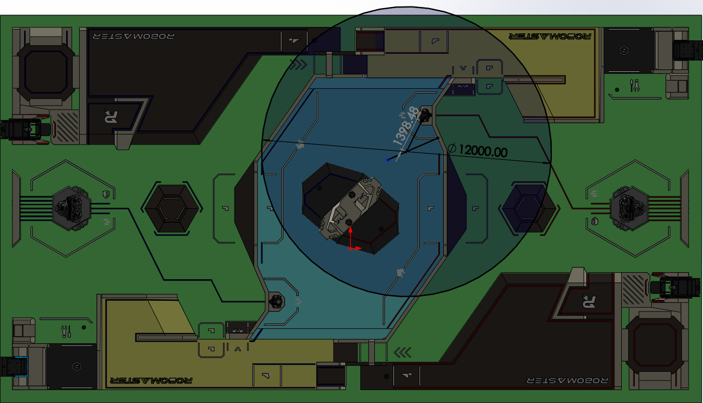
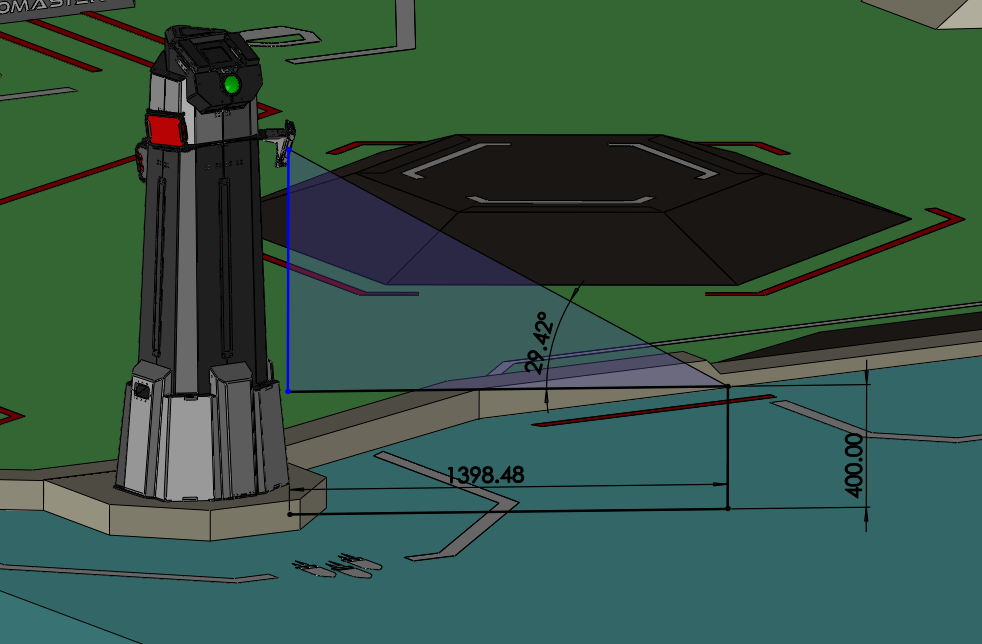

## 哨兵战术决策

#### 重要时间节点

先推前哨才能打基地，0分00秒-5分00秒如果把前哨（1500满血）推掉 ，我方可以占领对方前哨废墟，获得增益，如果对方基地（5000满血）每掉了1000血，对方可重建一次前哨（750血量，最多重建4次），重建消耗时间步哨英10秒，工程5秒；3分00秒之后前哨停止旋转，停止旋转后恢复到初始角度，5分01秒-7分00秒前哨不能被重建；

0-3min 补给区每秒回10%血量（10s），4-7Min每秒25%（4s）；复活后，30秒无敌，只有10%血量，但锁发射机构，回补给区回血彻底复活。初始允许发弹量为300；每过一分钟可以去补给区刷rfid直接免费获得100发弹量，发弹量在补给区累计，可延期一次性获得全部。

**重要规则**：基地护甲未展开前，由于装甲板位置过高，只能由英雄吊射，飞镖或飞机对基地造成伤害

基地护甲展开条件：比赛进行三分钟，且对方前哨被推掉，步兵和哨兵可以占领对方堡垒，占领满20秒对方护甲展开，基地可以直接被其他机器人打击；这20秒有100%易伤，对方基地护甲展开后，无易伤。

当基地血量小于2000点后，护甲也会展开。

#### 哨兵出家策略

比赛胜负重要性优先级：基地血量>前哨血量>对机器人造成的伤害

如果哨兵能出家，攻击对方前哨站（去年瞄上后30s左右推完），今年工程在装配区3分钟无敌，不要打工程；对方前哨站被推掉后，由于对方基地少1000血才能重建前哨站，对方可能会占领前哨站，所以依旧占住本点位，一方面用于攻击前来修复前哨的机器人，如果对方前哨被修复，同时可以继续打前哨；同时本点位亦可守住上高地的大部分道路，对路口形成压制力量。本来可以进入对方前哨增益区吃25%的防御增益，但因为裁判系统没有给对方前哨血量的串口，无法判断是否能继续打对方前哨，所以只能在这静候。

上述期间，如果基地血量减少到2500上己方堡垒。己方基地和前哨血量串口id：0x0003；如果哨兵血量不健康（小于150）或者发弹量（串口码0x0208）小于20，先回补给区，再回上述决策点。




##### 行为树：
0.包含四条路径：
补给区到前哨(csv:supply_to_outpost)，前哨到补给区(csv:outpost_to_supply)，
补给区到堡垒(csv:supply_to_fort)，堡垒到补给区(csv:fort_to_supply)。
回家机器人健康判定：检测血量（小于150）和发弹量（小于20）表示不健康。
出家机器人健康判定：检测哨兵血量(大于350)和发弹量（大于100）表示健康。
基地健康判定：检测基地血量（大于2500）表示健康。

1.检测开赛，如果非开赛不执行后续行为；
2.出家策略：
出家机器人健康程度判定，基地健康程度判定，如果机器人和基地都健康，补给区到前哨，此时位于前哨，到前哨后两个case,case1:回家机器人健康程度判定不健康且基地健康程度判定健康，前哨到补给区；case2:回家机器人健康程度判定健康且基地健康程度判定不健康，前哨到堡垒；

回家机器人健康程度判定，基地小于2500前哨到补给区(csv:outpost_to_supply)，检测哨兵血量(大于350)和发弹量（大于100）健康去去前哨(csv:supply_to_fort)；检测血量（小于150）和发弹量（小于20）表示不健康，回补给区(csv:fort_to_supply)，后继续回堡垒(csv:supply_to_fort)，然后检测血量和发弹量在堡垒和补给区之间来回切换。
#### 哨兵守家策略

如果哨兵不具备出家能力，开局上堡垒，如果哨兵血量不健康（小于150）或者发弹量（串口码0x0208）小于20，先回补给区，再回上述决策点。

#### 姿态切换策略

准备移动前，切换移动姿态（上位机给下位机发指令）；首次受击，切换防御姿态（下位机直接切换）；自瞄锁敌，切换攻击姿态（下位机直接切换）。

#### 哨兵参数

雷达滤波半径0.4m，雷达倾角60°，

### 行为树中文伪代码：
公共条件：

- 固定路径只有四条：补给区到前哨(csv:supply_to_outpost)、前哨到补给区(csv:outpost_to_supply)、补给区到堡垒(csv:supply_to_fort)、堡垒到补给区(csv:fort_to_supply)。
- 回家机器人健康判定：血量 < 150 或 发弹量 < 20，判定为不健康。
- 出家机器人健康判定：哨兵血量 > 350 且 发弹量 > 100，判定为健康。
- 基地健康判定：基地血量 > 2500，判定为健康。
- 两棵行为树都按顺序循环执行，每轮结束后都从根节点重新开始。

#### 守家行为树中文伪代码

```text
根节点：循环执行

1. 检测比赛是否开始
	- 若未开赛：等待，本轮结束，进入下一轮循环。
	- 若已开赛：进入守家决策。

2. 检测机器人当前位置（添加位置检测插件）
	- 若当前不在堡垒：执行 补给区到堡垒(csv:supply_to_fort)。
	- 若当前已在堡垒：直接进入下一步。

3. 到达堡垒后检测回家机器人健康判定
	- 若血量 < 150 或 发弹量 < 20：执行 堡垒到补给区(csv:fort_to_supply)。
	- 回到补给区后补血、补弹（自动完成），出家机器人健康判定：哨兵血量 > 350 且 发弹量 > 100，判定为健康后本轮结束，进入下一轮循环。

4. 若血量 >= 150 且 发弹量 >= 20
	- 继续驻守堡垒，本轮结束，进入下一轮循环。
```

#### 出家行为树中文伪代码

```text
根节点：循环执行

1. 检测比赛是否开始
	- 若未开赛：等待，本轮结束，进入下一轮循环。
	- 若已开赛：进入出家决策。

2. 检测当前是否具备出家能力
	- 若不具备出家能力：出家树返回失败，交给守家行为树处理。
	- 若具备出家能力：继续执行出家树。

3. 检测出家机器人健康判定
	- 若哨兵血量 <= 350 或 发弹量 <= 100：留在补给区补血补弹，本轮结束，进入下一轮循环。
	- 若哨兵血量 > 350 且 发弹量 > 100：继续执行。

4. 检测基地健康判定
	- 若基地血量 > 2500：进入前哨分支。
	- 若基地血量 <= 2500：进入堡垒分支。

5. 前哨分支
	- 若当前不在前哨：执行 补给区到前哨(csv:supply_to_outpost)。
	- 到达前哨后先检测基地健康判定：
	  - 若基地血量 <= 2500：
		 1) 执行 前哨到补给区(csv:outpost_to_supply)。
		 2) 在补给区重新检测出家机器人健康判定。
		 3) 若出家机器人健康：执行 补给区到堡垒(csv:supply_to_fort)，切换到堡垒分支。
		 4) 若出家机器人不健康：留在补给区补血补弹，本轮结束，进入下一轮循环。
	  - 若基地血量 > 2500：继续检测回家机器人健康判定。
	- 检测回家机器人健康判定：
	  - 若血量 < 150 或 发弹量 < 20：执行 前哨到补给区(csv:outpost_to_supply)。
	  - 回到补给区后，本轮结束，进入下一轮循环。
	  - 下一轮若出家机器人健康且基地健康：再次执行 补给区到前哨(csv:supply_to_outpost)。
	  - 因此机器人在补给区和前哨之间循环往返。
	- 若血量 >= 150 且 发弹量 >= 20 且 基地仍健康：继续留在前哨压制，本轮结束，进入下一轮循环。

6. 堡垒分支
	- 进入条件：基地不健康，或机器人在前哨时检测到基地由健康变为不健康。
	- 若当前不在补给区：先回补给区，再重新检测出家机器人健康判定。
	- 若出家机器人健康：执行 补给区到堡垒(csv:supply_to_fort)。
	- 到达堡垒后检测回家机器人健康判定：
	  - 若血量 < 150 或 发弹量 < 20：执行 堡垒到补给区(csv:fort_to_supply)。
	  - 回到补给区后，本轮结束，进入下一轮循环。
	  - 下一轮若基地仍不健康且出家机器人健康：再次执行 补给区到堡垒(csv:supply_to_fort)。
	  - 因此机器人在补给区和堡垒之间循环往返。
	- 若血量 >= 150 且 发弹量 >= 20：继续驻守堡垒，本轮结束，进入下一轮循环。

7. 分支切换规则
	- 只要基地健康，且出家机器人健康，优先进入前哨分支。
	- 一旦在前哨检测到基地不健康，先回补给区，再重新检测出家机器人健康，再转入堡垒分支。
	- 转入堡垒分支后，不再去前哨，直到后续策略显式要求重新切回前哨分支。
```
