2026年4月10日18:00 -  2026年4月13日18:00  参赛反馈  参赛队伍先行选择意向赛区，组委会将结 合学校所在地区及积分榜排名，最终决定 各赛区的参赛队伍名单。  

**2026 年5月** - 6月   **区域赛**（内地赛区）  

2026年6月 技术评审：区域赛赛季总结 获得区域赛奖金发放资格  

2026 年7月 - 8月  全国总决赛（含复活赛及全国赛）

2026年8月  技术评审：全国总决赛赛季总 结  获得全国总决赛奖金发放资格    

比赛时间七分钟；脱战：连续六秒未发射弹丸未扣血；临时激活：阵亡后，底盘云台被临时上电，但发射机构断电

射击热量：射击热量随机器人发弹而增加，用于限制机器人连续发弹；哨兵机器人编号：7

只有步兵和哨兵可占领自己堡垒

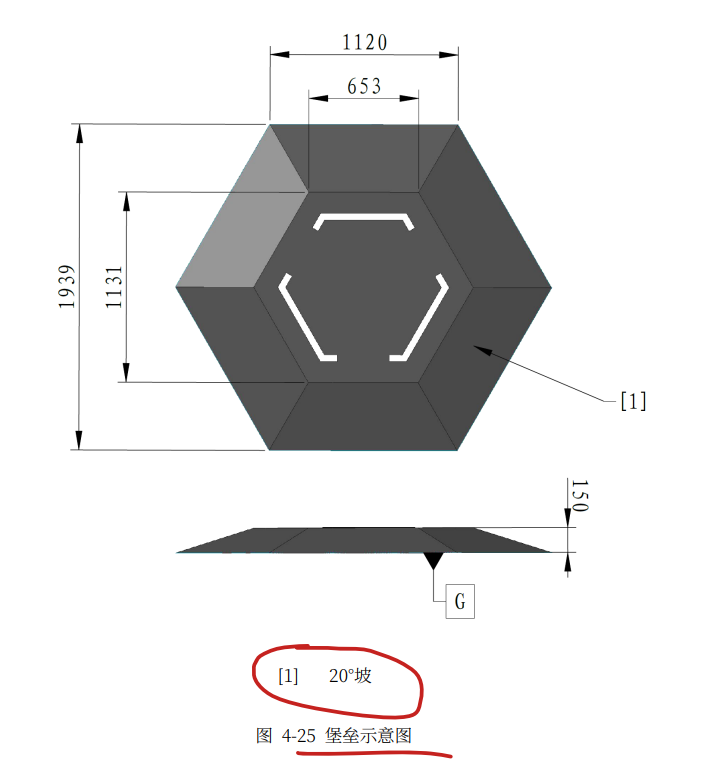

哨兵机器人可全自动或半自动运行，可以发射17mm弹丸。 

可以向所有己方机器人发送数据，但只能接收雷达的数据

自动哨兵机器人  

 初始血量/上限血量为400  射击热量上限为260  

 射击热量冷却速率为30/秒   底盘功率上限为100W 

1个17mm发射机构

射击初速度上限（m/s） 25 

扣血与超限惩罚机制  全部适用

回血与复活机制  补给区/远程回血+读条复活/兑换金币复活

初始允许发弹量为300；每过一分钟可以免费去补给区获得100发弹量，发弹量在补给区累计，可延期一次性获得

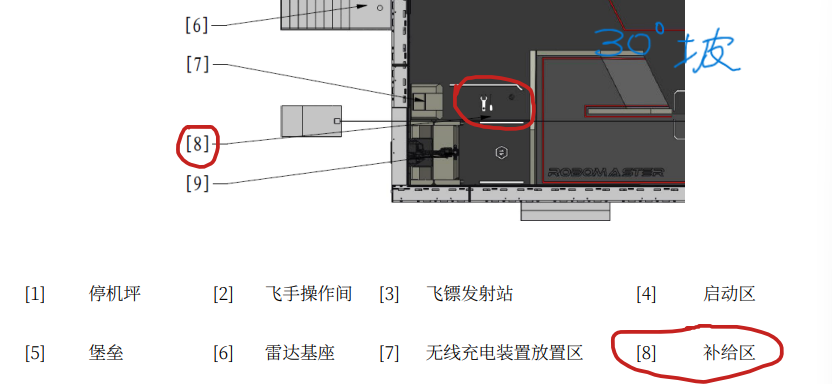

可通过补给区、基地增益点、前哨站增益点兑换或直接获取、远程兑换允许发弹量 

通过裁判系统选手端兑换允许发弹量，或者用裁判系统串口兑换

射击初速度超限时，该机器人的发射机构会被锁定，一定时间后解锁

0-3min 补给区每秒回10%血量（10s），4-7Min每秒25%（4s）,远程换血60%

战场：长28m，宽15m

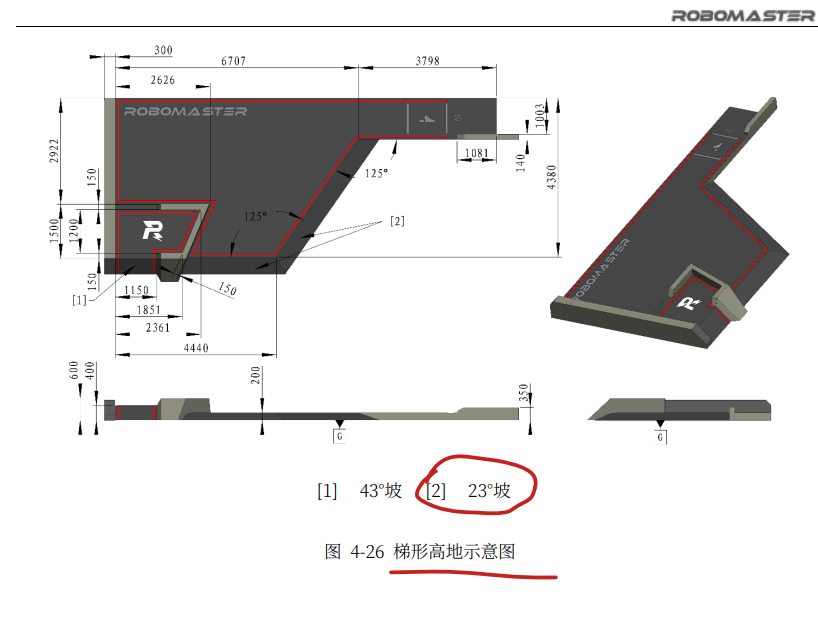

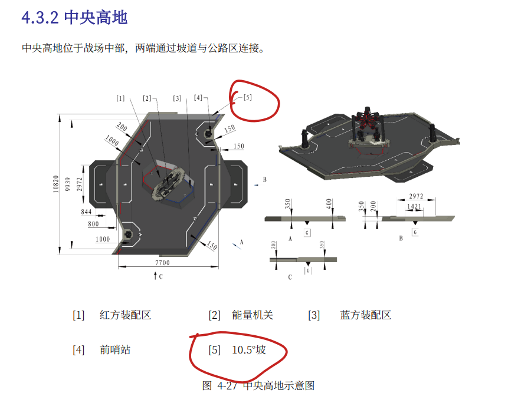

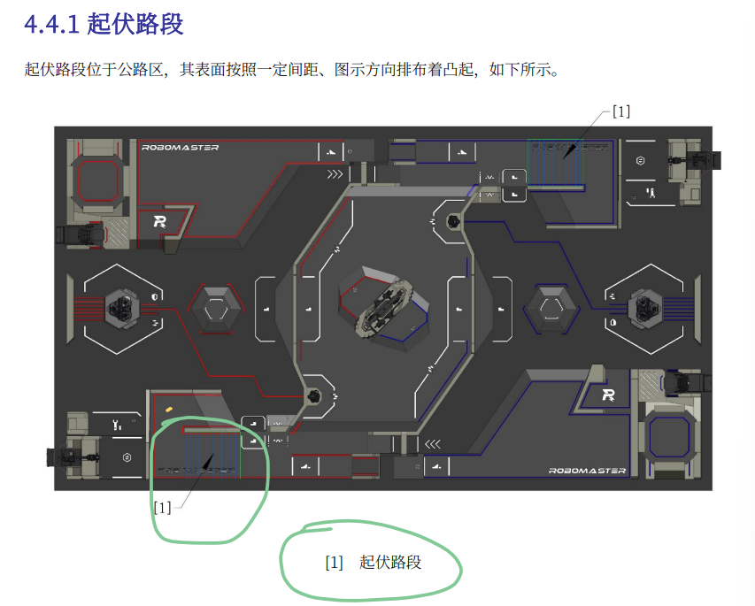

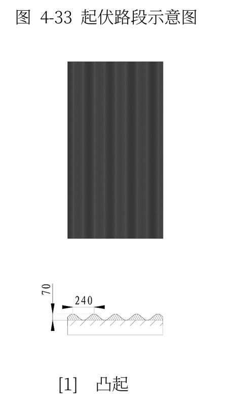

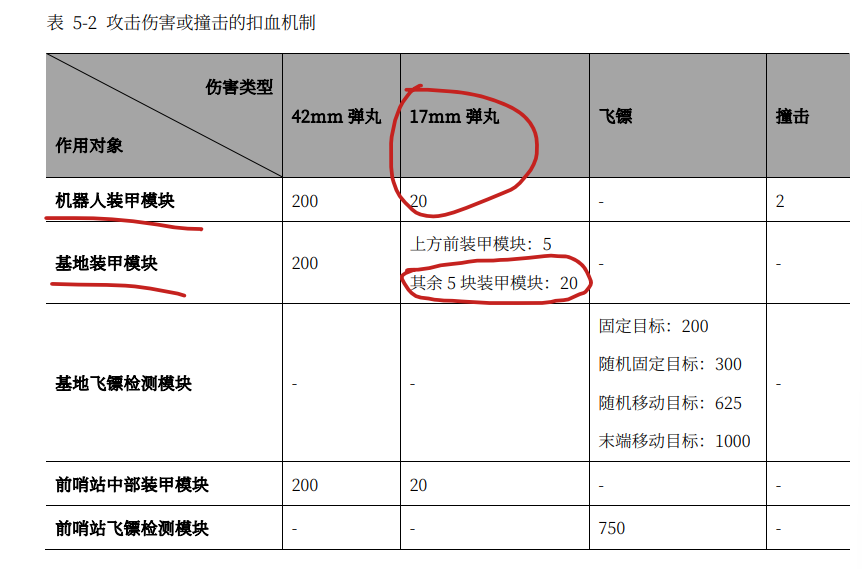

**复活：**

1、读条复活，比赛时间越长，复活时间越短；补给区死亡或基地血量低于2000，复活增速为4倍

复活后，30秒无敌，只有10%血量，但锁发射机构，无法占领任何增益点且无法重建前哨站；回前哨站、基地增益点或补给区增益点，解锁发射机构，无敌失效，彻底复活。

2、金币兑换复活

3秒无敌，彻底复活，4秒提高底盘功率上限1倍

经济体系

400初始金币，1分钟免费获得50，完整形态考核中的“项目文档”和“技术方案”影响初始金币；

占领补给区、基地增益点、前哨站增益点时，操作手或者用裁判系统串口可兑换允许发弹量，最低一次兑换10发，远程兑换：150金币/100发，非远程兑换：10金币/10发；比赛开始后，每隔1分钟，哨兵机器人可以通过占领己方补给区增益点获取100发允许发弹量，未通过此 方式获取的允许发弹量可以累积。

机器人首次获得地形跨越增益（公路）、地形跨越增益（高地）、地形跨越增益 （飞坡）、地形跨越增益（隧道）时，均可获得300点经验。

当一方前哨站存活，基地处于无敌状态。当基地血量降至2000及以下时，基地护甲将展开，前哨停止旋转。当一方前哨站被击毁后，另一方可以占领被击毁的前哨站对应的增益点。

一方每累计损失1000点基地血量，获得1次可积累的“重建前哨站“机会。英雄、步兵、哨兵机器人通 过连续检测己方前哨站增益点场地交互模块卡10 秒，或工程机器人连续检测己方前哨站增益点场地交互模块卡 5 秒（不同机器人占领时长独立计算），即可“重建”被击毁的前哨站，使前哨站恢复存活状态并具有750点血量。在比赛开始5分钟后，前哨站不能够再被重建。

当满足以下任意条件时，一方前哨站装甲停止旋转：   该方前哨站首次被击毁   对方基地护甲展开   比赛开始3分钟后 ；5分01秒-7分00秒前哨不能被重建

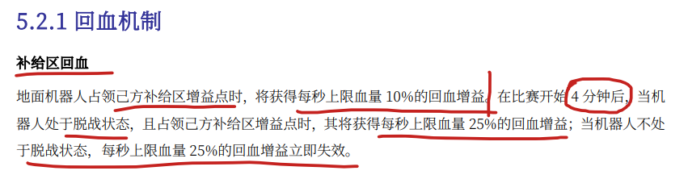

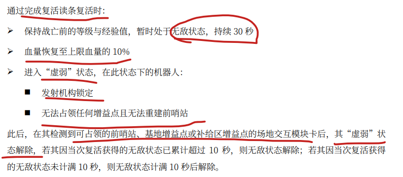

基地增益：50%防御增益，兑换允许发弹量，以及解除“虚 弱”状态

中央高地增益：25%防御增益。 

前哨站增益：若己方前哨站存活，可被占领；5分钟内，己方前哨站存活，对方前哨站被击毁，可以占领对方前哨站。允许兑换发弹量，获得25%防御增益，解除“虚弱”及其对应的无敌状态；可多机占领

补给区增益：提升复活读条速度或获得回血增益

堡垒：己方只能由一台机器人占领己方堡垒，但可多机占领对方堡垒，在己方前哨站首次被击毁前，堡垒增益点处于失效状态。在己方前哨站被首次击毁后，堡垒增益点生效。 
己方占领：防御+热量+允许发弹量
占领对方堡垒：3分钟后且击毁对方前哨，可占领，获得100%易伤，单次占领慢20秒，对方基地护甲展开，可以离开3秒，期间保留计时。

哨兵开局默认自动控制，可以向裁判系统发送信息，兑弹，兑血，复活，切换姿态

三分钟准备阶段开始后，十五秒裁判系统自检阶段前，云台手可选择对应哨兵机器人的操作方式为自动控 制或半自动控制。若在指定时间内未选择操作方式，则在七分钟比赛阶段开始后，默认为自动控制。哨兵 机器人可以通过向裁判系统服务器发送信息的方式自主兑换允许发弹量、远程兑换发弹量、远程兑换血量、 确认复活、兑换立即复活、切换姿态。 

此外，云台手可以通过裁判系统选手端相关指令干预哨兵机器人的行动，具体指令包括：   转发小地图标记    在补给区、基地增益点、前哨站增益点购买允许发弹量   确认复活   远程兑换发弹量   远程兑换血量   远程兑换立即复活   切换姿态  对于半自动哨兵，上述操作无需消耗金币；对于自动哨兵，云台手每进行一次上述的操作，需要花费50金 币。 

哨兵机器人拥有“姿态”系统，可以强化部分能力而削弱其他能力。哨兵机器人开局默认处于移动姿态。 姿态切换具有5秒的冷却时间。每局中，哨兵机器人若累计处于一个姿态时间超过3分钟，该姿态效果下降。

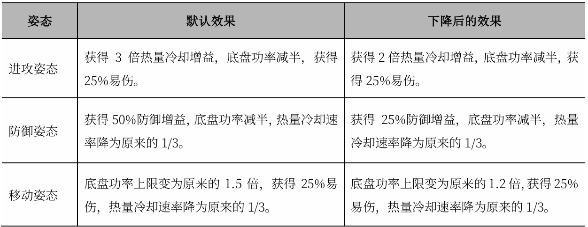

具有 20000 的初始底盘能量和40000的底盘能量上限。在 底盘能量消耗至 0 后，机器人将进入“节能”状态。处于“节能”状态下的机器人，其底盘功率上限将变 为35W。在底盘能量大于等于25000 时，机器人底盘功率上限基础值将变为对应性能体系和等级底盘功 率上限基础值的125%，最高不会超过200W。

本赛季将不单独设置哨兵建图环节

禁止使用第三方成品模组

1个17mm发射机构，最大重量25 kg，包含电池重量，但不包含裁判系统 重量(重量为3.25kg)

最大收纳尺寸（mm），机器人存在一种长、宽、高不大于 600X600X600的状态 

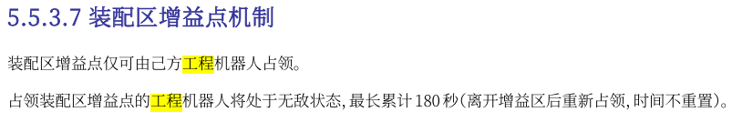

装配区不要打对面工程

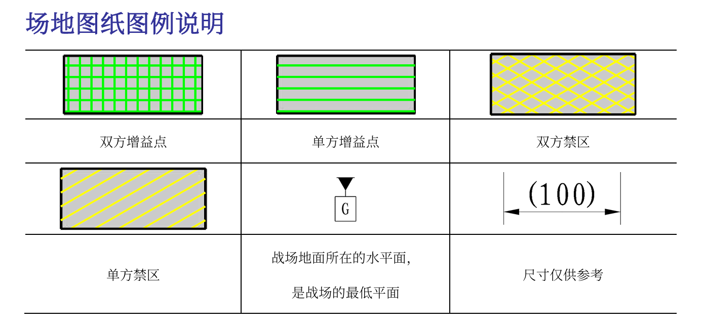

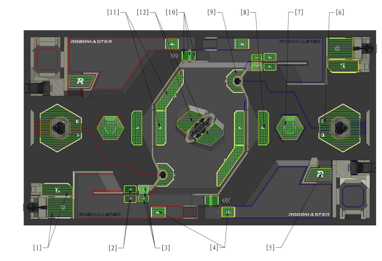

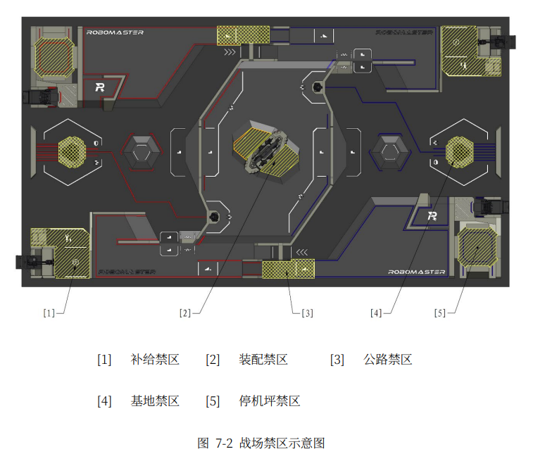

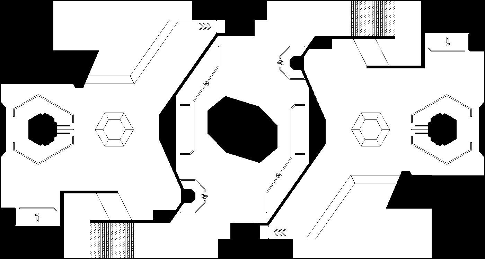

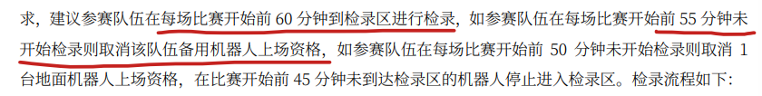

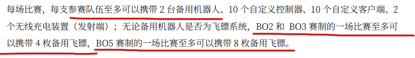

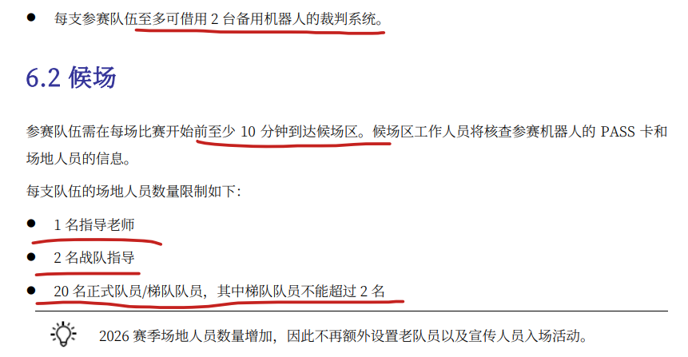

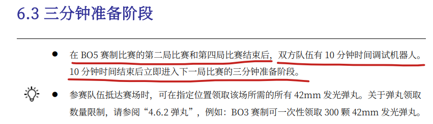

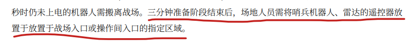

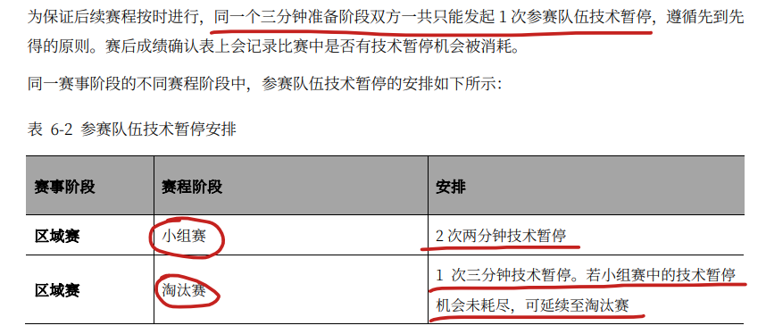

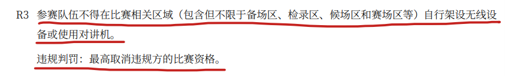

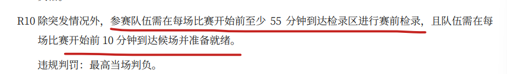

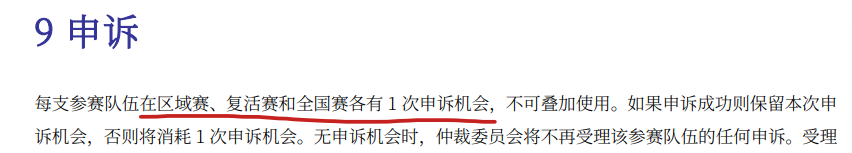

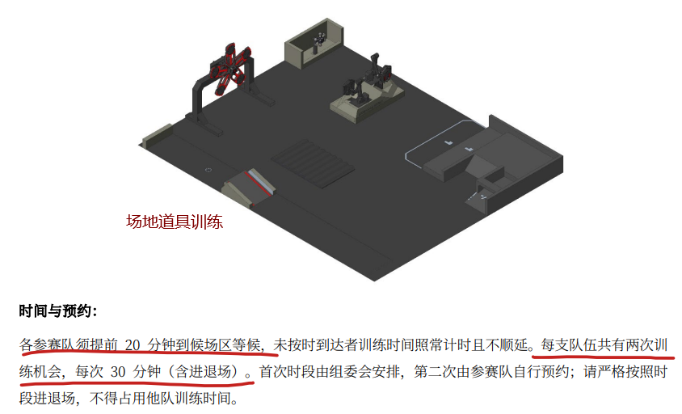

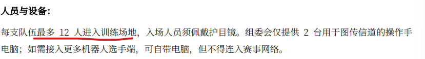

